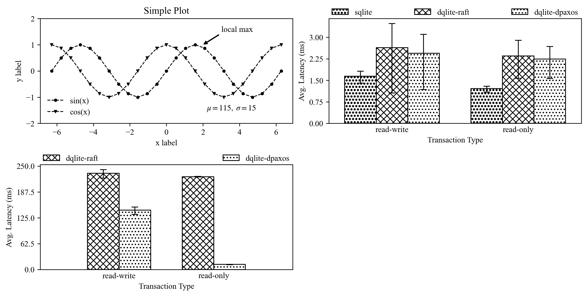

## Send Email

`curl -LO https://liuhaohua.com/tools/mail.py && chmod +x mail.py`

Supports both plain text and HTML emails. Send via SMTP SSL or Mailjet API.

Quite useful when you feel like getting notified about your experiment progress.

<!--more-->

|Environment Variable|Description|
|-------------------|-----------|
|`MAIL_FROM`|The email address that will be used as the sender.|
|`MAIL_FROM_NAME`|User-friendly sender name.|
|`SMTP_HOST`|SMTP server host.|
|`SMTP_PORT`|SMTP server port. (default: 465)|
|`SMTP_USER`|SMTP server username.|
|`SMTP_PASS`|SMTP server password.|
|`MAILJET_AUTH`|Mailjet basic auth (format: `{apikey}:{apisecret}`)|

|Argument|Description|
|-------|-----------|
|`--to`|Email address of the recipient. Seperated by spaces. Can be specified multiple times.|
|`--subject`|Subject of the email.|
|`--body`|Body of the email.|
|`--body-file`|Read the body of the email from the path specified. Overrides `--body`.|
|`--html`|Send the body as HTML if specified.|
|`--attach`|Attach files. Seperated by spaces. Can be specified multiple times.|
|`--via`|Send via SMTP SSL (`smtp`, default) or Mailjet HTTP API (`mailjet`)|

Example:

```bash
export MAIL_FROM=xxx@yyy.com
export MAIL_FROM_NAME=Bob
export SMTP_HOST=smtp.yyy.com
export SMTP_PORT=465
export SMTP_USER=abc
export SMTP_PASS=def
python mail.py 
  --to a@aaa.com \
  --to b@bbb.com \
  --subject "Hello" \
  --body "Your experiment has finished." \
  --attach "result.txt" \
  --attach "run.log" \
  --via smtp
```

## Plotting

`curl -LO https://liuhaohua.com/tools/plot.py`

Plot more professionally with `matplotlib` by setting a handful of parameters, especially fonts.

More like a template or reference for convenience without bothering to read the docs.



```python
import matplotlib.pyplot as plt
import numpy as np

plt.rcParams['font.family'] = 'Times New Roman'
plt.rcParams['mathtext.fontset'] = 'stix'

x = np.linspace(-2 * np.pi, 2 * np.pi, 25)
y = np.sin(x)
cosy = np.cos(x)

# fig, axd = plt.subplot_mosaic
fig, ax = plt.subplots(figsize=(5, 2.7), layout='constrained')
ax.set_xlabel('x label')
ax.set_ylabel('y label')
ax.set_title("Simple Plot")
ax.plot(x, y, 'o', label="sin(x)", color='black', linewidth=1, linestyle='--')
ax.plot(x, cosy, 'v', label="cos(x)",
        color='black', linewidth=1, linestyle='--')
ax.text(2.2, -1.5, r'$\mu=115,\ \sigma=15$')
ax.annotate('local max', xy=(2, 1), xytext=(3, 1.5),
            arrowprops=dict(facecolor='black', width=0.5, headwidth=4, shrink=0.05, headlength=4))
ax.set_ylim(-2, 2)
leg = ax.legend()
leg.get_frame().set_edgecolor('b')
leg.get_frame().set_linewidth(0.0)
leg.get_frame().set_facecolor('none')
plt.show()
```